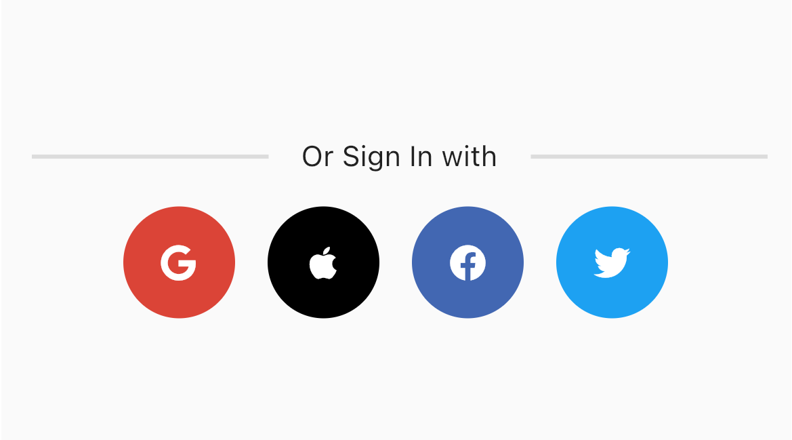

# Sl_Social_Auth

This package provide social login implimentation in flutter with minimum line of code.

## Feature of the package

Following features are currently supported by this package

- SignIn with Google
- SigIn With Twitter 
- SigIn with Facebook(Under Development)
- SigIn with apple(Under Development)


## Dependency

This package is depends on [Firebase core](),[Firebase_Auth](), [google_sign_in](https://pub.dev/packages/google_sign_in), [sign_in_with_apple](https://pub.dev/packages/sign_in_with_apple), [flutter_facebook_auth](https://pub.dev/packages/flutter_facebook_auth) and [twitter_login](https://pub.dev/packages/twitter_login)


## Configuration
### Firebase Android configuration 

[Documentation](https://firebase.flutter.dev/docs/manual-installation/android/)

Need to create project as per the Documentation and dont forgot to add debug SHA key from Firebase console
- Create Firebase project
- Download google_services.json file and place into android/src folder
- Add gradle dependency as per the Documentation
- Enable Google auth Provider
- Add SHA Keys


### Firebase ios configuration 

[Documentation](https://firebase.flutter.dev/docs/manual-installation/ios)

Need to create project as per the Documentation.
- Create Firebase project
- Download GoogleService-Info.plist file and place into ios/runner folder
- install cocapods
- Enable Google auth Provider 


### Apple configuration
[Documentation](https://firebase.flutter.dev/docs/auth/social/#twitter)

- Yet to Update
<!-- Need to create app in twitter developer.
- Generate app key, secret key and apply for Elevated access
- Enable twitter auth provider in firebase_auth
- add app key and secret key in firebase auth provider
- register callback URl in developer console
- install cocapods -->


### Facebook configuration
[Documentation](https://firebase.flutter.dev/docs/auth/social/#twitter)

- Yet to update
<!-- Need to create app in twitter developer.
- Generate app key, secret key and apply for Elevated access
- Enable twitter auth provider in firebase_auth
- add app key and secret key in firebase auth provider
- register callback URl in developer console
- install cocapods -->

### Twitter  configuration 

[Documentation](https://firebase.flutter.dev/docs/auth/social/#twitter)

Need to create app in twitter developer.
- Generate app key, secret key and apply for Elevated access
- Enable twitter auth provider in firebase_auth
- add app key and secret key in firebase auth provider
- register callback URl in developer console
- install cocapods


### Example
initialize project in main.dart file

```dart
void main() async {
  //initializ project by adding following  one line

  await SlSocialAuth.initializedSocialAuth(ensureInitialized: true);
  runApp(const MyApp());
}
```

Simple use following function to integrade SignIn with Google

```dart
//it will return the dynamic response as per the status

SlSocialAuth slSocialAuth = SlSocialAuth();
var res = await slSocialAuth.signInWithGoogle();
if (res.isAuthenticated) {
  log("logged in");
} else {
  log(res.msg);
}
 
```
Simple use following function to integrade SignIn with Apple

```dart
//it will return the dynamic response as per the status

SlSocialAuth slSocialAuth = SlSocialAuth();
var res = await slSocialAuth.signInWithApple();
if (res.isAuthenticated) {
  log("logged in");
} else {
  log(res.msg);
}
 
```
Simple use following function to integrade SignIn with Facebook

```dart
//it will return the dynamic response as per the status

SlSocialAuth slSocialAuth = SlSocialAuth();
var res = await slSocialAuth.signInWithFacebook();
if (res.isAuthenticated) {
  log("logged in");
} else {
  log(res.msg);
}
 
```
Simple use following function to integrade SignIn with Twitter

```dart
//it will return the dynamic response as per the status

SlSocialAuth slSocialAuth = SlSocialAuth();
var res = await slSocialAuth.signInWithTwitter(
                                  apiKey:  twitterApiKey ,
                                  apiSecretKey: twitterSecrectKey ,
                                  redirectURI:  twitterRedirctUrl );
if (res.isAuthenticated) {
  log("logged in");
} else {
  log(res.msg);
}
 
```


You can directly use socail auth widget in your login screen


<table>
  <tr>
    <td>Auth Widget Code</td>
     <td>UI</td> 
  </tr>
  <tr>
    <td>
    
```dart
 SlAuthWidget(
              isGoogleEnable: true,
              isTwitterEnable: true,
              twitterApiKey: Config.twitterApiKey,
              twitterSecrectKey: Config.twitterSecretKey,
              title: 'Or Sign In with',
              twitterRedirctUrl: Config.redirectUrl,
              onAuthenticated: (authType, slAuthResponse) {
                log("Google login authenticated");
                log(slAuthResponse.authData!.user!.email.toString());
              },
              onFailure: (authType, authResponse) {
                log(authType.toString() + " failed: " + authResponse.msg);
              },
            ),

```
</td>
    <td></td>
  
  </tr>
 </table>


## Roadmap

- SignIn with Google

- Sign With FaceBook

- signIn with Apple

- SignIn with Twitter 

